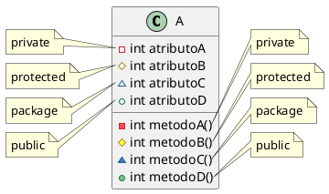
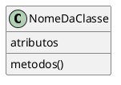
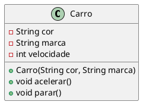
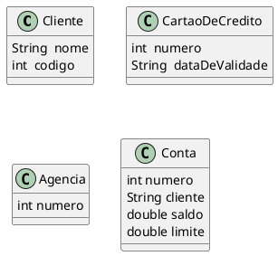

# Encapsulamento

- Separar o programa em partes, tornando cada parte mais isolada possível uma da outra
- A ideia é tornar o software mais flexível, fácil de modificar e de criar novas implementações
- Permite utilizar o objeto de uma classe sem necessariamente conhecer sua implementação
- Protege o acesso direto aos atributos de uma instância fora da classe onde estes foram criados
- Uma grande vantagem do encapsulamento é que toda parte encapsulada pode ser modificada sem que os usuários da classe em questão sejam afetados


## Modificadores de acesso
- private
- protected
- public
- <padrão> (package, quando não é especificado nenhum dos 3 acima)

<figure>



<figcaption>Modificadores de acesso.</figcaption>
</figure>

- São aplicados a atributos, métodos, construtores e classes
- As classes só podem ser declaradas como public ou padrão
    - Uma classe com acesso padrão só pode ser detectada por classes do mesmo pacote
    - Uma classe com acesso público pode ser detectada por classes de todos os pacotes

- Private
    - Os membros privados só podem ser acessados por um código da mesma classe 
- Protected
    - Os membros protegidos podem ser acessados por outras classes do mesmo pacote, além de subclasses independente do pacote 
- Public
    - Os membros públicos podem ser acessados por todas as outras classes, mesmo de pacotes diferentes
- Padrão
    - Os membros padrão só podem ser acessados por outras classes do mesmo pacote

### Métodos de acesso (get e set)

Como os atributos/métodos privados ​​só podem ser acessadas dentro da mesma classe (uma classe externa não tem acesso a ela) é possível acessá-los se fornecermos métodos públicos *get* e *set*.

O *get* retorna o valor da variável e o *set* define o valor.

A sintaxe para ambos é que eles começam com *get* ou *set* seguido pelo nome do atributo com a primeira letra em maiúscula:

```java
public class Pessoa {
  private String nome; // private = acesso restrito
  // Get
  public String getNome() {
    return nome;
  }
  // Set
  public void setNome(String novoNome) {
    if(novoNome!= null && !novoNome.isEmpty() && !novoNome.isBlank()){
      this.nome = novoNome;
    }
  }
}
```
O método *get* retorna o valor da variável name.

O método *set* pega um parâmetro ( novoNome) e o atribui ao atributo *nome*. 

A palavra-chave `this` é usada para se referir ao objeto atual.

No entanto, como o atributo `name` é declarada como `private`, não podemos acessá-la de fora desta classe:

```java
public class Main {
  public static void main(String[] args) {
    Pessoa pessoa = new Pessoa();
    pessoa.nome = "João";  // error
    System.out.println(pessoa.nome); // error 
  }
}
```

Se o atributo foi declarada como *public,* esperaríamos a seguinte saída:
```shell
    João
```

No entanto, ao tentar acessar um atributo *private,* obtemos um erro:

```shell
    Main.java:4: error: nome has private access in Pessoa
        pessoa.nome = "João";
              ^
    Main.java:5: error: nome has private access in Pessoa
        System.out.println(pessoa.nome);
                                 ^
    2 errors
```
    
Em vez disso, usamos os métodos getNome()e setNome()para acessar e atualizar a variável:

Exemplo
```java
public class Main {
  public static void main(String[] args) {
    Pessoa pessoa = new Pessoa();
    pessoa.setNome("João"); // Seta o valor do atributo nome para "João"
    System.out.println(pessoa.getNome());
  }
}
```
saida 

```shell
    "João"
```
 
 
## Por que encapsulamento?

- Melhor controle dos atributos e métodos da classe
- Os atributos de classe podem ser somente leitura (se você usar apenas o método *get*) ou somente gravação (se você usar apenas o método *set*)
- Flexível: o programador pode alterar uma parte do código sem afetar outras partes
- Maior segurança de dados

## Estereótipo de uma Classe em UML

<figure>



<figcaption>Modelo de uma classe em UML.</figcaption>
</figure>


## Estrutura básica de uma classe

```java{3-5,7-11,13-18}
public class Carro {

    private String cor;
    private String marca;
    private int velocidade;

    public Carro(String cor, String marca){
        this.cor = cor;
        this.marca = marca;
        velocidade = 0;
    }

    public void acelerar(){
        velocidade++;
    }
    public void parar(){
        velocidade = 0; 
    }
}

```

```java
class Programa{
  public static void main(String[] args){
    Carro c1 = new Carro("vermelha","BMW");
    //Carro c2 = new Carro();// ERRO
  }
}

```

## Representação UML

<figure>



<figcaption> UML da classe carro.</figcaption>
</figure>

- A UML é uma notação que podemos utilizar para representar classes e objetos em modelos computacionais

- Linguagem para representação de modelos visuais com um significado especifico e padronizado

- UML não é uma linguagem de programação

- Os modelos são representados através de diagramas que possuem semântica própria
O diagrama que representa a descrição das classes é o **Diagrama de Classes**


## Domínio de Aplicação

- Um domínio é composto pelas entidades, informações e processos relacionados a um determinado contexto.
- Uma aplicação pode ser desenvolvida para automatizar ou tornar factível as tarefas de um domínio. 
- Portanto, uma aplicação é basicamente o "reflexo" de um domínio.
- Para exemplificar, suponha que estamos interessados em desenvolver uma aplicação para facilitar as tarefas do cotidiano de um banco. Podemos identificar clientes, funcionários, agências e contas como entidades desse domínio. Assim como podemos identificar as informações e os processos relacionados a essas entidades.

### Outras classes do domínio de um sistema bancário

<figure>



<figcaption> UML de classes do domínio bancários.</figcaption>
</figure>